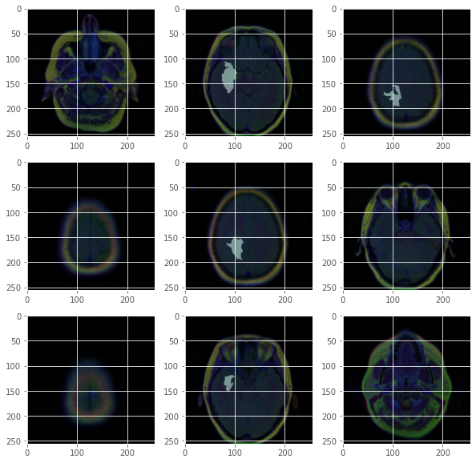
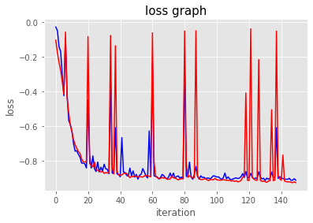
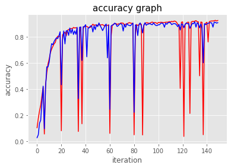

# Brain_Image-Segmentation
In this code I have implemented a Kaggle dataset of Brain MRI Segmentation (https://www.kaggle.com/mateuszbuda/lgg-mri-segmentation)
 
# Example of the images in dataset

 
# The loss of the model

 
# The accuracy of the model

